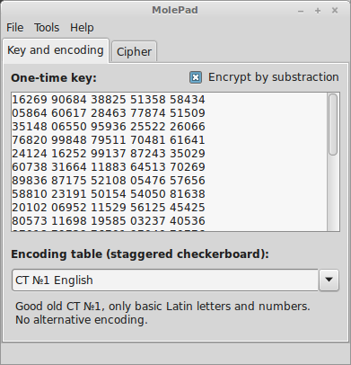

Mole Pad
========

Pen-and-pencil friendly one-time-pad cipher tool. Includes integrated staggered checkerboard encoder/decoder. Currently in alpha stage.

Features
--------

1. Many encoding tables included, plus ability to load custom one from file
2. Shows intermediat result of encryption/decryption process
3. Pen-and-pencil friendly algorithm, tested and approved by generations of spies

